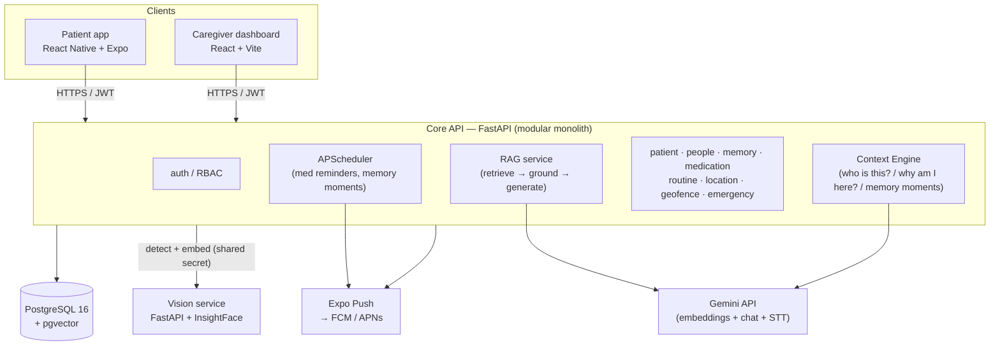

# Architecture

> Prototype / portfolio project. Not a medical device.

## 1. System overview

Three clients, one core backend, one small vision service, one database.




```
┌─────────────────────────┐     ┌─────────────────────────────┐
│  PATIENT APP             │     │  CAREGIVER DASHBOARD         │
│  React Native + Expo     │     │  React + Vite + TypeScript   │
│  camera · voice · SOS ·  │     │  profiles · memories ·       │
│  Memory Moments          │     │  approve AI suggestions ·    │
│                          │     │  meds · zones · alerts       │
└───────────┬─────────────┘     └──────────────┬──────────────┘
            │        HTTPS / JSON  (JWT in Authorization header)
            └─────────────────┬────────────────┘
                              ▼
      ┌─────────────────────────────────────────────────┐
      │  CORE API — FastAPI (modular monolith)           │
      │                                                 │
      │  api/v1  (thin routers)                          │
      │     │                                            │
      │  services/                                       │
      │   ├── auth_service         JWT, RBAC             │
      │   ├── patient_service                            │
      │   ├── people_service       + relationships/graph │
      │   ├── memory_service       approve / reject flow │
      │   ├── rag_service          retrieval + grounding │
      │   ├── ai/  (LLMProvider) ──────────► Gemini API  │
      │   ├── context_engine   ◄── the differentiator    │
      │   │      combines face + relationships +         │
      │   │      approved memories + meds + location     │
      │   │      → one calm, sourced patient response    │
      │   ├── medication_service                         │
      │   ├── location_service / geofence_service        │
      │   ├── notification_service ──► Expo Push (FCM)    │
      │   └── emergency_service                          │
      │                                                 │
      │  models/ (SQLAlchemy)   schemas/ (Pydantic)      │
      └───────────────┬──────────────────┬──────────────┘
                      │                  │ HTTP (internal, shared secret)
                      ▼                  ▼
      ┌──────────────────────────┐  ┌──────────────────────────┐
      │ PostgreSQL 16 + pgvector │  │ VISION SERVICE           │
      │ relational data +        │  │ FastAPI + InsightFace    │
      │ vector columns           │  │ detect face → 512-dim    │
      │ (memories, face_embeds)  │  │ embedding (stateless)    │
      └──────────────────────────┘  └──────────────────────────┘
```

**Monorepo, but not a distributed monolith:** each folder (`backend`, `vision-service`,
`mobile`, `dashboard`) is independently deployable, has its own dependency file, its own
Dockerfile, its own tests, and talks to the others only over HTTP.

## 2. Why a modular monolith + exactly one service

- The **core API** is one FastAPI app split into service modules with clean boundaries. One
  deploy, one process, one database, real transactions. A solo project gains nothing from
  splitting `auth` and `people` into separate services except network calls and pain.
- The **vision service** is separate because InsightFace drags in `onnxruntime`, `opencv`,
  `numpy` and ~300 MB of model weights, and it is CPU-bound (matrix math) while the core API
  is I/O-bound (DB, LLM, network). Different dependency footprint, different scaling profile,
  easy to test in isolation (image in → vector out).

See [`adr/0002-modular-monolith-plus-vision-service.md`](adr/0002-modular-monolith-plus-vision-service.md).

## 3. Backend layering (inside `backend/app/`)

```
HTTP request
  → api/v1/*.py       router: reads path/query, current user; calls one service; returns
  → schemas/*.py      Pydantic: validates the request body / shapes the response
  → services/*.py     business logic + authorization ("can this caregiver see this patient?")
  → repositories/*.py DB queries (SQLAlchemy)
  → models/*.py       ORM classes ↔ tables
  → PostgreSQL
  ← response flows back up, serialized by a Pydantic response schema
```

Rule: route handlers stay thin (no business logic, no raw SQL). Logic lives in services.

## 4. The Context Engine (differentiator)

A backend service module that turns raw data into a short, calm, **sourced** answer for the
patient. It never invents facts — the LLM only rephrases retrieved, caregiver-approved content.

**"Who is this?"**
```
camera frame → Core API → Vision Service (detect + embed)
  → pgvector similarity search over THIS patient's registered people only
  → best match ≥ threshold?
      yes → load person + relationship + recent approved memories
          → RAG prompt → "This is Rahul, your son. He visited last Sunday with mangoes."
              + sources: [memory #42]
      no  → "I don't recognise this person. You can ask a family member."
```

**"Why am I here?"**
```
Core API gathers: current time, today's routine items, upcoming medication, current location
  vs home zone, any recent Memory Moment
  → RAG prompt → "You're at home. It's the afternoon. Your next tablet is at 4 o'clock."
```

**Memory Moments**: a lightweight scheduled job (APScheduler) picks one approved, gentle
memory once or twice a day and pushes it to the patient app.

## 5. Caregiver-controlled AI memory

`memories.status ∈ {pending, approved, rejected}`. Only `approved` memories are retrievable by
RAG. AI-suggested memories are inserted as `pending` and surface in the dashboard for the
caregiver to approve or reject. Source of every suggestion is recorded.

See [`adr/0006-caregiver-controlled-memory.md`](adr/0006-caregiver-controlled-memory.md).

## 6. Hallucination-resistant RAG

1. Hard filter: `patient_id` (+ person when known).
2. Vector rank: `ORDER BY embedding <=> :query_embedding`.
3. Similarity floor: drop matches below a threshold (this is how irrelevant memories are kept out).
4. Small `LIMIT` (e.g. 5).
5. Prompt rule: answer **only** from the provided memories; if they don't contain the answer,
   say "I'm not sure". Never guess relationships or events.
6. Response includes the memory ids/text used → **source attribution** shown in both apps.

## 7. Auth & authorization

- JWT: short-lived access token (~15 min) + refresh token (~14 days). Argon2 password hashing.
- Roles: `caregiver`, `patient`. Enforced by a FastAPI dependency.
- Resource-level check on top of role: a caregiver may only touch patients they are linked to
  (`patient_caregivers`). Patient devices are provisioned by the caregiver with a long-lived
  device token (patients don't manage passwords).
- Secrets only via environment variables (`pydantic-settings`). `.env` gitignored.

## 8. Location & geofencing

- Geofence = circle (center lat/lng + radius). Server is the **authoritative** checker; the
  mobile app just reports location periodically. Distance via the Haversine formula.
- Robustness against GPS drift: radius buffer, require N consecutive "outside" readings before
  alerting, hysteresis on re-entry. Missing updates = "unknown", never "safe".
- Alerts are **explainable**: they carry the reason, last known point, distance, and time.

## 9. Notifications

Expo Push (one integration → FCM on Android, APNs on iOS). Device tokens in a `devices` table.
`notification_service` is provider-agnostic, same pattern as the LLM provider.

## 10. Security & privacy posture

- Auth on every non-public endpoint; authorization scoped to linked patients.
- **Consent record** before any face is registered (who, when, purpose).
- Data minimization: store the face **embedding**, not the enrolled photo (photo discarded
  after embedding unless the caregiver opts in).
- Deletion endpoints: remove a person (+ embeddings + their memories) and remove a whole patient.
- Pydantic validation on every request body; upload validation (type + magic bytes + size + re-encode).
- Rate limiting on `/auth/*` and `/emergency/*`.
- Memory text is user-supplied and goes into LLM prompts → delimited clearly, never allowed to
  override the system prompt (prompt-injection awareness).
- Prominent "not a medical device" disclaimer in both apps.

## 11. Deployment (later phases)

- Core API + vision service → Render (Docker). DB → Neon (managed Postgres + pgvector).
- Dashboard → Vercel. Mobile → Expo EAS builds.
- Structured to lift to AWS later (ECS + RDS + S3) without code rewrites.

## 12. Deliberately NOT used

Kubernetes · Kafka / message brokers · Redis · Neo4j · a dedicated vector DB · GraphQL ·
monorepo tooling (Nx/Turborepo). Each would add operational weight with no real benefit at
this scale. The memory "graph" is a self-referential Postgres table.

## 13. Phase plan

| Phase | Deliverable |
|------:|-------------|
| 0  | Repo, skeleton, docs, docker-compose (**done**) |
| 1  | Backend foundation: FastAPI + SQLAlchemy + Alembic + Postgres, health check, config |
| 2  | Authentication + authorization (JWT, roles, resource scoping) |
| 3  | Patient / caregiver / family-member profiles + **person relationships** |
| 4  | Patient mobile app foundation (Expo, auth, adaptive simple UI) |
| 5  | Face registration + recognition (vision service + consent + pgvector match) |
| 6  | Memory system + **caregiver approve/reject** workflow |
| 7  | Embeddings + pgvector wiring for memories |
| 8  | RAG AI Memory Assistant + **source attribution** + hallucination guards |
| 9  | Context Engine (contextual "Who is this?" / "Why am I here?" / Memory Moments) **+ Voice assistant** (STT → RAG/Context → TTS) — merged |
| 10 | Medication management + reminders + adherence (taken / missed / pending) |
| 11 | Daily routine reminders |
| 12 | Location tracking |
| 13 | Geofencing + **explainable** caregiver alerts |
| 14 | Emergency / SOS |
| 15 | Caregiver web dashboard (ties everything together) |
| 16 | Push notifications (Expo Push) |
| 17 | AI memory **suggestions** (AI proposes memories → pending → caregiver approves) |
| 18 | Security hardening pass |
| 19 | Testing pass (coverage + integration/E2E) |
| 20 | Docker (all services) + CI/CD (GitHub Actions) |
| 21 | Deployment (docs/deployment.md + render.yaml + vercel.json) |
| 22 | Documentation + architecture/ER diagrams |
| 23 | **Dedicated interview-preparation phase** (full review + mock interviews) — pending |

Phases 0–22 are built and committed. Phase 23 (interview prep) is deliberately kept
separate and done last.

_(Phases 9 and the original "voice" phase were merged during the build, so the plan is
now 23 phases. Numbering here matches the git history from Phase 9 onward.)_

Tests are written *within* each backend phase; Phase 20 is a coverage/E2E pass, not the start
of testing.
