# Database schema

One PostgreSQL 16 database with the `pgvector` extension. 21 tables. Managed with
SQLAlchemy 2.0 models + Alembic migrations (`backend/alembic/versions/`).

## ER diagram

```mermaid
erDiagram
    users ||--o| caregiver_profiles : "has"
    users ||--o{ refresh_tokens : "issues"
    users ||--o{ patient_caregivers : "linked via"
    patient_profiles ||--o{ patient_caregivers : "linked via"
    patient_profiles ||--o{ patient_devices : "provisions"
    patient_profiles ||--o{ people : "knows"
    patient_profiles ||--o{ person_relationships : "scopes"
    people ||--o{ person_relationships : "from / to"
    people ||--o{ face_embeddings : "identified by"
    people ||--o{ consents : "consented for"
    patient_profiles ||--o{ memories : "about"
    people ||--o{ memories : "mention"
    memories ||--o{ memory_sources : "traced to"
    patient_profiles ||--o{ medications : "takes"
    medications ||--o{ medication_logs : "dosed"
    patient_profiles ||--o{ routine_items : "does"
    routine_items ||--o{ routine_completions : "checked off"
    patient_profiles ||--o{ locations : "reports"
    patient_profiles ||--o{ geofences : "has zone"
    geofences ||--o| geofence_states : "current state"
    geofences ||--o{ geofence_events : "enter / exit"
    patient_profiles ||--o{ alerts : "raises"
    patient_profiles ||--o{ emergency_contacts : "has"

    users {
        int id PK
        string email UK
        string password_hash "nullable"
        enum role "caregiver | patient"
        bool is_active
    }
    patient_profiles {
        int id PK
        string full_name
        date date_of_birth
        float home_lat
        float home_lng
        string timezone
        int created_by FK
    }
    patient_caregivers {
        int id PK
        int patient_id FK
        int caregiver_id FK
        enum access_level "owner | viewer"
    }
    patient_devices {
        int id PK
        int patient_id FK
        string pairing_code_hash "sha256, single-use"
        string token_jti "for revocation"
        string expo_push_token
        bool revoked
    }
    people {
        int id PK
        int patient_id FK
        string display_name
        string relationship_label "relation to patient"
        bool is_active
    }
    person_relationships {
        int id PK
        int patient_id FK
        int from_person_id FK
        int to_person_id FK
        enum relationship
    }
    face_embeddings {
        int id PK
        int person_id FK
        vector embedding "512-d, HNSW cosine index"
        string model_version
        float det_score
    }
    consents {
        int id PK
        int patient_id FK
        int person_id FK
        int granted_by FK
        string purpose
        timestamp revoked_at "nullable"
    }
    memories {
        int id PK
        int patient_id FK
        int person_id FK "nullable"
        text text
        enum status "pending | approved | rejected"
        enum source "caregiver | ai_suggestion"
        vector embedding "768-d, HNSW, only when approved"
        int reviewed_by FK
    }
    memory_sources {
        int id PK
        int memory_id FK
        enum origin "dashboard_note | voice_transcript | chat"
        text raw_excerpt
    }
    medications {
        int id PK
        int patient_id FK
        string name
        string[] schedule_times "HH:MM"
        bool active
    }
    medication_logs {
        int id PK
        int medication_id FK
        date scheduled_date
        string scheduled_time
        enum status "taken | skipped | missed"
        string marked_via "patient | caregiver"
    }
    routine_items {
        int id PK
        int patient_id FK
        string title
        string time_of_day
        int[] days_of_week "Mon=0..Sun=6"
    }
    routine_completions {
        int id PK
        int routine_item_id FK
        date on_date
    }
    locations {
        int id PK
        int patient_id FK
        float lat
        float lng
        float accuracy_m
        timestamp recorded_at
    }
    geofences {
        int id PK
        int patient_id FK
        string name
        float center_lat
        float center_lng
        float radius_m
    }
    geofence_states {
        int geofence_id PK
        bool is_inside
        int outside_streak "hysteresis"
    }
    geofence_events {
        int id PK
        int geofence_id FK
        int patient_id FK
        enum event "exit | enter"
        float distance_m
    }
    alerts {
        int id PK
        int patient_id FK
        enum type "geofence_exit | geofence_return | sos | medication_missed"
        enum severity "info | warning | critical"
        string reason_text "human-readable"
        json context "distance, last point, contacts…"
        timestamp acknowledged_at
    }
    emergency_contacts {
        int id PK
        int patient_id FK
        string name
        string phone
        int priority
    }
    refresh_tokens {
        int id PK
        string jti UK
        int user_id FK
        timestamp expires_at
        bool revoked
    }
    caregiver_profiles {
        int user_id PK
        string phone
        string notes
    }
```

## Notes

- **Vector columns**: `face_embeddings.embedding vector(512)` and
  `memories.embedding vector(768)`, each with an HNSW index on cosine distance
  (`ix_face_embeddings_hnsw`, `ix_memories_embedding_hnsw`) created via raw SQL in
  the migrations (Alembic's `include_object` filter ignores them so autogenerate
  doesn't try to drop them).
- **Cascade deletes**: deleting a `patient_profiles` row removes everything scoped to
  it. Deleting a `people` row removes its embeddings, consents, relationship edges;
  its `memories.person_id` is set NULL (the memory text is kept).
- **Enums** are stored as `VARCHAR` with a check (`native_enum=False`) so adding a
  value doesn't need a Postgres enum migration.
- **Timestamps** are `timestamptz`, stored UTC. Patient-local time is derived from
  `patient_profiles.timezone` where it matters (medication reminders, "today" views).
